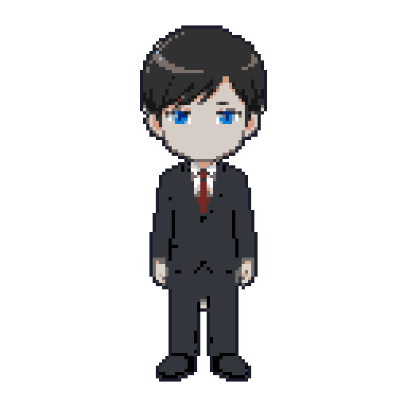
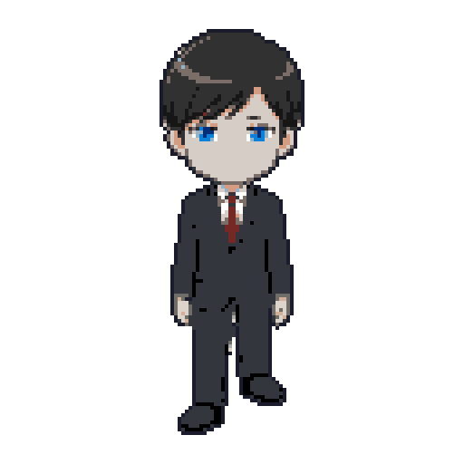
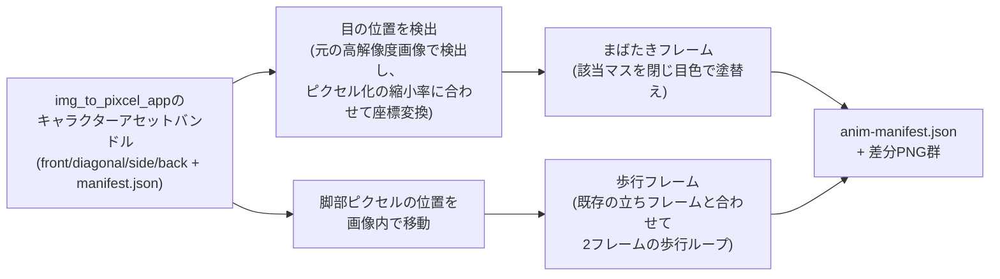

# ani_convert_app (PixelAnimator)

[img_to_pixcel_app](https://github.com/Afarg/img_to_pixcel_app) が生成したピクセルキャラクター画像（1〜4アングル）を読み込ませると、**まばたき**と**歩行**の差分フレームを自動生成するローカルWebアプリ。

> Generates blink and walk-cycle diff frames from pixel-art character sprites produced by `img_to_pixcel_app`, by editing the existing sprite pixels in place — no new viewpoints are fabricated.

3プロジェクトから成るパイプラインの2段目にあたるツール（生成した差分フレームは [agent-village](https://github.com/Afarg/agent-village) のダッシュボードに取り込むと、キャラクターが目を閉じたり歩いたりするアニメーションとして表示される）。

## 実際の生成結果

`img_to_pixcel_app` が生成した静止画（下記GIFの1コマ目）に対して、このツールが実際にまばたき・歩行フレームを生成した結果。

| まばたき | 歩行 |
|---|---|
|  |  |

## これは何に使うか（用途）

- 静止画のピクセルキャラクターに、まばたき・歩行という最低限の「生きている感」を持たせたいとき。
- 手描きでアニメーションフレームを作る手間をかけずに、既存のドット絵スプライトから機械的に差分フレームを生成したいとき。
- [agent-village](https://github.com/Afarg/agent-village) のように、複数キャラクターを同時に動かすダッシュボード/ゲームで、統一的な手法でアニメーションを揃えたいとき。

## 図解: 差分フレーム生成の仕組み



**設計原則**: 「新しい視点を作らない」— まばたき・歩行のどちらも、既に画像内にある情報（目の位置・脚の位置）を書き換えるだけの決定論的な処理であり、提供されていないアングルの生成は行わない。これは [img_to_pixcel_app](https://github.com/Afarg/img_to_pixcel_app) と共通の設計方針。

## 特徴

- **まばたき**: 元画像（ピクセル化前の高解像度画像）から目の位置を検出し、ピクセル化の縮小率に合わせて座標変換。最終ピクセルグリッド上で目にあたるマスを閉じ目色に塗り替えて生成。
- **歩行**: アングルを問わず、既存スプライトの脚部ピクセルを画像内で動かすことで歩行ループ用の2フレーム目を生成する決定論的処理。
- 提供されたアングルの数だけ同じ手法を適用し、提供されなかったアングルはスキップする（バンドルに `front` しか無いケースも前提として扱う）。
- FastAPI + ブラウザUIでのプレビュー対応。

## 使い方

### セットアップ

```bash
python -m venv .venv
.venv/Scripts/activate   # Windows: .venv\Scripts\activate / macOS・Linux: source .venv/bin/activate
pip install -r requirements.txt
uvicorn app.main:app --reload
```

`http://127.0.0.1:8000/` を開くと、[img_to_pixcel_app](https://github.com/Afarg/img_to_pixcel_app) が出力したキャラクターアセットバンドル（フォルダごと）をアップロードしてプレビューできる。

### APIとして直接呼び出す場合

入力は `img_to_pixcel_app` の `/api/convert` が返す `bundle.zip` の中身（`manifest.json` を含むフォルダ）をそのままアップロードする。

```bash
curl -X POST http://127.0.0.1:8000/api/animate \
  -F "files=@bundle/manifest.json" \
  -F "files=@bundle/front.png" \
  -F "files=@bundle/front.pre.png"
```

レスポンスにはアングルごとの `idle`（まばたき込み）・`walk`（歩行2フレーム）の画像URL一覧と、`anim-manifest.json` のURLが含まれる。この出力をそのまま [agent-village](https://github.com/Afarg/agent-village) のキャラクターアセットとして取り込める。

## 技術スタック

- Python / FastAPI（`uvicorn`）
- 画像処理: Pillow, OpenCV（`opencv-python-headless`）, NumPy, Matplotlib

## ドキュメント

| ドキュメント | 内容 |
|---|---|
| `00-overview.md` | 全体像・スコープ・背景 |
| `01-architecture.md` | システム構成・技術スタック |
| `02-generation-pipeline.md` | まばたき・歩行差分の生成パイプライン詳細 |
| `03-environment-and-setup.md` | 環境構築手順 |
| `04-output-format-and-agent-village-handoff.md` | 出力形式・Agent Villageへの受け渡し |
| `05-constraints-and-limitations.md` | 制約・既知の限界 |

## 既知の課題・改善計画

現状の課題と修正方針は [`IMPROVEMENTS.md`](IMPROVEMENTS.md) にまとめている。
