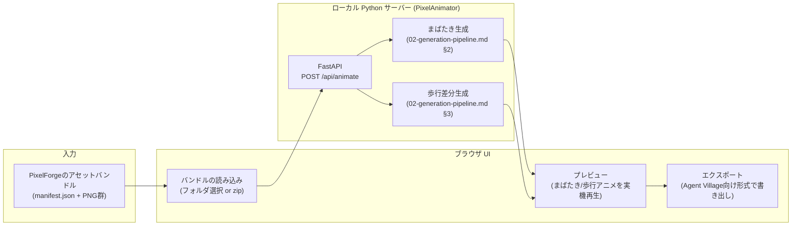

# 01. アーキテクチャ — PixelAnimator

対象読者: 実装者。
関連: `00-overview.md`（スコープ）、`02-generation-pipeline.md`（内部処理）。

---

## 1. 全体構成方針

`img_to_pixcel_app`（PixelForge）と同じ「Python + 軽量サーバー + ブラウザ」構成を踏襲する（`img_to_pixcel_app/docs/design/01-architecture.md` §1で確立した方針と一貫させる）。Pillow/NumPyといった依存も共通なので、実装・運用の知見を使い回せる。

## 2. コンポーネント構成

## 3. 技術スタック

| 層 | 技術 | 理由 |
|---|---|---|
| サーバー | Python 3.10+ / FastAPI + uvicorn | `img_to_pixcel_app`と共通の方針 |
| 画像処理 | `Pillow` | ピクセル単位の読み書き・貼り付け（フレーム合成）に使用 |
| 目・顔検出 | `opencv-python-headless`（彩度ベースのヒューリスティック、`02-generation-pipeline.md` §2.1） | **実機検証で判明**: 当初想定していたHaar cascade（`haarcascade_eye.xml`）は、インストールしたOpenCVビルド（5.0.0系）に同梱されておらず、公式配布元からのダウンロードも本セッションの権限設定でブロックされた。ヒューリスティックのみの方式に切り替えて実装した（GUI依存の無い`opencv-python-headless`を採用し、`connectedComponentsWithStats`等の基本機能のみ利用） |
| 数値・境界計算 | `NumPy` | bounding box、脚部領域の切り出し・シフト処理 |
| フロントエンド | 素のHTML/CSS/JS | `img_to_pixcel_app`と同じ方針。Canvasでアニメーションのプレビュー再生 |

## 4. なぜこの目検出方式は「決定論的」と言えるか

彩度・形状・連結成分といった古典的な画像処理だけで完結しており、ニューラルネットワーク（`rembg`のような）は使っていない。以下の点でAI生成的なアプローチとは性質が異なる:

- 出力は「検出できた/できなかった、座標はどこか」という決定論的な結果であり、絵柄そのものを生成する処理ではない。
- モデルファイルのダウンロードが一切不要（`opencv-python-headless`の基本機能のみ）。
- 検出に失敗しても「何も描き足さない」フォールバックに倒せる（後述`04-output-format-and-agent-village-handoff.md`・`05-constraints-and-limitations.md`）。

そのため`img_to_pixcel_app`で確立した「コアは決定論的パイプラインのみ、AI生成は将来オプション」という方針と矛盾しない。

**Haar cascadeについて（将来検討）**: 当初はOpenCV同梱のHaar cascade（`haarcascade_eye.xml`）をメイン手法にする想定だったが、実装時にインストール済みビルドに同梱されておらず、公式配布元からの取得も本セッションの権限設定でブロックされたため見送った（`03-environment-and-setup.md` §3）。ヒューリスティックのみで実用上十分な精度が実機検証できたため、無理に追加する必要は今のところ無いが、精度を上げたくなった場合の拡張候補として残しておく。
