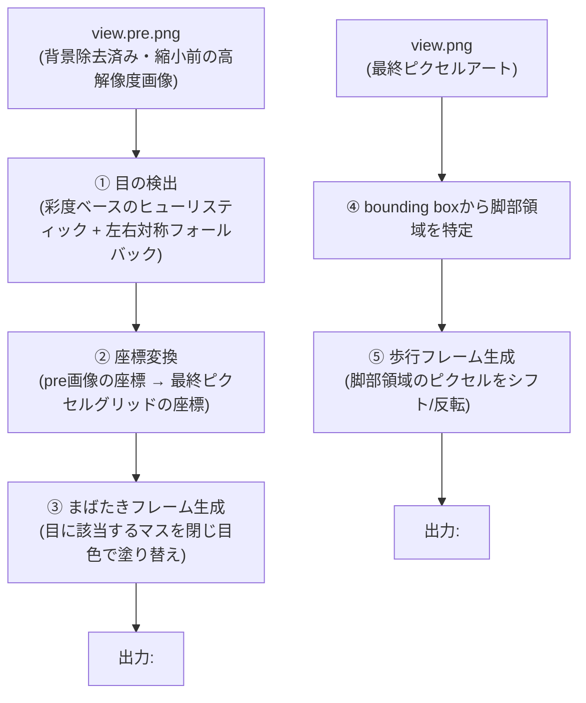

# 02. 生成パイプライン設計 — PixelAnimator

対象読者: 実装者。
関連: `01-architecture.md`（技術スタック）、`../../img_to_pixcel_app/docs/design/06-multi-angle-input.md`（入力バンドルの形式）。

---

## 1. 全体像

入力バンドルの`views`に含まれる**各アングルに対して独立に**、以下の2種類の差分フレームを生成する。



## 2. まばたきフレームの生成

### 2.1 目の検出（実装済み・実機検証済み）

> **更新履歴（実機検証で判明・修正済み）**: 当初案は「Haar cascadeをメイン、失敗時に明度ベースのヒューリスティックにフォールバック」だったが、実装時に2つの問題が見つかり、**ヒューリスティックのみの方式に作り直した**。
>
> 1. **Haar cascade自体が使えなかった**: インストールしたOpenCV（5.0.0系ビルド）に`haarcascade_eye.xml`が同梱されておらず、`cv2.data.haarcascades`以下にファイルが存在しなかった。OpenCV公式リポジトリからのダウンロードも試みたが、本セッションの権限設定でブロックされた。Haar cascade自体は将来ファイルを用意できれば追加できる設計にしておくが、今回はヒューリスティックのみで進めた（`01-architecture.md` §3・`05-constraints-and-limitations.md` §3）。
> 2. **「頭部領域内で最も暗い塊」という当初のヒューリスティックが実際のキャラクターで失敗した**: 目が赤色の実キャラクターで検証したところ、最も暗いのは目ではなく髪・帽子の陰影で、検出枠が帽子に乗ってしまった。**「暗さ」ではなく「彩度の高さ」**を信号にするよう変更（肌は低彩度、アニメ調の目は多くの場合彩度が高いため）。
> 3. さらに、彩度だけだと**髪の光沢（ハイライト）が目より大きい彩度領域として誤検出される**ことも判明。形状（縦横比が極端に細長い髪の房を除外）と探索範囲（頭部全体ではなく、顔の高さ帯に限定）を絞って対処した。
> 4. それでも「2つ目の目」は片方が前髪等で隠れて安定して見つからないことがあったため、**確実に見つかった方の目（primary）を、キャラクターの中心線で左右反転した位置**をもう片方の目として使う方式にした（顔は左右対称という前提）。反転位置の近くに十分な大きさの候補が実在すればそちらを採用し、無ければ反転生成した矩形をそのまま使う。
>
> **更新履歴（2026-07-29、2つ目の目の位置ズレを修正）**: 上記4の反転方式について、ユーザーから「片目の瞬き位置が目とズレている」という指摘を受けて調査したところ、**翼など左右非対称な要素がキャラクター全体のbounding box中心を本来の顔の中心線からズラしていた**ことが判明した（実測: 反転計算に使うbounding box中心が実際の顔の中心線から約20px(pre.png座標)ズレていた）。さらに、反転先の近くにある実際の目のピクセルは彩度ヒューリスティックの連結成分ラベリングで数十個の1〜9px片に分断されており（アンチエイリアシングによる濃淡差が原因）、どの断片も候補フィルタを安定して通過できず、3で追加した「反転位置近くの候補とマッチング」でも拾えていなかった。
>
> ユーザー提案（「目の色を把握し、その色の中でも最も暗い色を中心に補正してはどうか」）を採用し、`_refine_eye_center()`を追加: primaryの実ピクセル色（**矩形ボックスではなく実際の連結成分のピクセル**、輪郭・瞳孔の黒が混ざらないよう区別）から目の代表色を求め、2つ目の目の暫定位置（マッチング結果 or 反転位置）の周辺ウィンドウ内でその色に近いピクセルを探し、その中でも暗めの部分の重心を最終位置とする。連結成分がどれだけ分断されていても、色が合致するピクセルさえあれば拾えるため、ラベリングの分断に影響されない。primary自身の中心も同じ手法で精緻化する（生の矩形中心だとハイライト等でズレることがあるため）。実機検証で、修正前は完全にズレていた2つ目の目の塗りつぶし位置が、実際の目のピクセルと重なるようになったことを確認した。
>
> 最終的な実装（`app/blink.py`の`detect_eyes()`）:
>
> - 顔の高さ帯（bounding boxの25%〜65%、既定値）の中で、彩度上位15%かつ縦横比0.4〜2.5の連結領域を候補とする。
> - 最大面積の候補を`primary`（確実な方の目）とする。実際の連結成分ピクセルの色から目の代表色を求め、`_refine_eye_center()`でprimary自身の中心も精緻化する。
> - `primary`を中心線で反転した位置の近くに、`primary`の40%以上の面積を持つ候補があればそれを採用。無ければ反転位置をそのまま暫定位置とする。いずれの場合も`_refine_eye_center()`で目の代表色をもとに実ピクセルへ補正する。
> - 候補が1つも見つからなければ`[]`を返す。呼び出し側はこれを「まばたきフレームを生成しない」の合図として扱う（無理に描き足さない、`img_to_pixcel_app/docs/design/04-constraints-and-limitations.md` §4と同じ考え方）。

### 2.3 座標変換

`manifest.json`に記録されている`scale`・`cropBox`（`06-multi-angle-input.md` §5）を使い、`view.pre.png`上で検出した目の座標を、最終ピクセルグリッド（`view.png`）上のマス目に変換する。

```python
grid_x = (eye_x - crop_box.x) / scale
grid_y = (eye_y - crop_box.y) / scale
```

### 2.4 まばたきフレームの描画

> **更新履歴（2026-07-29、塗りつぶし色を輪郭色→顔色に修正）**: 当初は変換後の座標に該当する最終グリッド上の1〜2マスを、既存の輪郭色（`#1a1c2c`系、`img_to_pixcel_app/docs/design/02-conversion-pipeline.md` §2⑤で使っているのと同じ色）で塗りつぶしていたが、実機で確認したところ**黒い点にしか見えず、閉じた目には見えない**というフィードバックを受け、キャラクター自身の顔色で塗りつぶす方式に作り直した（ユーザー要望）。以下は現行の設計。
>
> **更新履歴（2026-07-29・2回目、塗りつぶし範囲を拡大）**: §2.1の目の位置精緻化後も、実機で「両目ともY軸がズレて下にはみ出している」という指摘を受けた。座標変換・検出のサブピクセル精度をこれ以上追い込むより、**塗りつぶす面積自体を1マス分(`block`)から2px大きく**する方が単純で確実と判断した（ユーザー提案）。多少肌色がはみ出して塗られても見た目への影響は軽微だが、小さすぎて実際の目を塗り残す方が閉じ目に見えず問題が大きいため。実機検証で、拡大後は実際の目のピクセル位置が塗りつぶし範囲に完全に収まることを確認した。
>
> **更新履歴（2026-07-29・3回目、`grid_size=64`/`output_size=64`でのバグ修正）**: `grid_size=64・colors=8・output_size=64`（`upscale_ratio=output_size/grid_size=1.0`）の組み合わせをユーザー指示で実機テストしたところ、目の色が1px塗り残る不具合を発見した。原因は塗りつぶしサイズを`block`（`round(upscale_ratio)`、grid_sizeに依存）から算出していたこと。目の最終画像上の実サイズは`output_size`だけで決まり`grid_size`（内部の量子化グリッドの細かさ）には依存しないため、`upscale_ratio`が小さい（＝`grid_size`が`output_size`に近い）ほど塗りつぶし範囲が不当に縮んでしまっていた。塗りつぶしサイズの基準を`block`から**`output_size`のみに基づく`unit`**（`round(output_size/32)`）に置き換え、`grid_size=32`・`grid_size=64`の両方（`output_size=64`固定）で実機検証し、塗り残しが解消しつつ`grid_size=32`側の見た目も変わらないことを確認した。

目の位置を、輪郭色ではなく**そのキャラクター自身の顔の色**（両目を囲む近傍マスのうち最頻色）で塗りつぶし、肌が目を覆うような見た目にする。

- 最初に「顔の高さ帯（`face_band`、既定0.25〜0.65、`detect_eyes()`と同じ帯）で最頻色を取る」という単純な方式を試したが、**2頭身のキャラクターだと帯が顔から肩・襟元まではみ出し、ジャケットの色が「顔の色」として選ばれてしまう**ことが実機検証で判明した（`detect_eyes()`の彩度ベース検出はこの帯の広さでも問題にならないが、「帯内の最頻色」という単純集計はこの汚染に弱い）。
- そこで、**検出した目それぞれの直近マス（1マス分の余白）だけをプールした集合**から最頻色を取る方式に変更した。目の周囲は体のプロポーションによらず必ず肌なので、これで胴体色の混入を避けられる。両目分をまとめてプールすることで、片目の直近だけがたまたま髪や耳にかかっていても、もう片方のデータで補える（実機検証で確認: 左右の目でバラバラの色になる問題が、プールしたことで解消した）。
- 直近マスに何も無い（画像端に近い等）場合は`face_band`の最頻色にフォールバックし、それも無ければ輪郭色を最終フォールバックとする（無理に描き足さない、フェイルソフト方針は維持）。
- 輪郭色自体は候補から常に除外する（どの領域の境界にも現れるため、除外しないと「最頻色」に輪郭色が選ばれやすい）。

新しいピクセルを描き足すのではなく、**既存のマスの色を置き換えるだけ**なので、キャラクターの輪郭・シルエット自体には影響しない。

## 3. 歩行フレームの生成

> **更新履歴（2026-07-29、対側性の腕振りに作り直し）**: 当初の「脚部領域を丸ごと水平反転する」方式から、**腰から下を左右に分割し、さらに手を検出して、右足が上がる時は左手、左足が上がる時は右手が同時に上がる**という対側性の歩行パターンに作り直した（ユーザー要望）。以下は現行の設計。

### 3.1 腰ラインと脚の左右分割

- 最終ピクセルアート（`view.png`）の非透過領域のbounding box（既に`img_to_pixcel_app`側で計算済みの値を`manifest.json`経由で受け取るか、ここで再計算する）を使い、**縦方向の下35%程度**を「腰から下（脚部領域）」とみなす（`agents_app/docs/design/01-visual-concept.md`が前提とする「2頭身」の体型比率を踏まえた既定値、`leg_fraction`）。
- 脚部領域を、キャラクター全体の水平中心線（bounding boxの`(x0+x1)/2`）で**左脚／右脚に分割**する。

> **更新履歴（2026-07-29、シフト対象を脚部領域の下側だけに縮小）**: 当初は`leg_fraction`で決めた脚部領域を丸ごとシフトしていたが、ユーザーから「歩行パターンで胴体がつぶれて見える」という報告を受けて調査したところ、**丈の長いジャケットを着たキャラクターでは、裾が`leg_fraction`の境界より下まで伸びており、脚部領域の中にジャケットの裾（本来は胴体側の要素）まで含まれてしまう**ことが判明した。脚部領域を丸ごと1ブロックとしてシフトすると、このジャケット裾も脚と一緒に持ち上がってしまい、裾の輪郭に切れ込みができて「胴体が崩れた」ように見えていた（ピクセル単位の差分比較で、この問題自体は色パレット修正の前から存在しており、色数を減らしたことで視覚的に目立つようになっただけと確認済み）。
>
> 対応として、新しいパラメータ**`shift_fraction`（既定0.65）**を導入し、**脚部領域(`leg_fraction`)の中でもさらに下寄りの`shift_fraction`分だけを実際のシフト対象とする**よう変更した（脚部領域の上側、胴体に近い部分はシフトしない）。実機検証で、ジャケットの裾が`grid_size=32`・`64`のどちらでも欠けずに保たれ、かつ足が上がる見た目自体は維持されることを確認した。

### 3.2 手の検出（`app/walk.py`の`detect_hands()`）

`app/blink.py`の`detect_eyes()`と同じ設計方針を踏襲する: 最終ピクセルアートではなく**高解像度の`pre.png`上で検出**し、`scale`・`output_size`/`grid_size`で最終画像座標へ変換する（`04-output-format-and-agent-village-handoff.md`の座標変換と同じ考え方）。

- 探索範囲は肩〜腰の帯（bounding boxの縦55%〜85%、既定値）のうち、**さらに左右それぞれの外縁付近の細い帯**（半幅の40%）に限定する。胴体・脚まで含めた帯全体で「支配色」を取ると、脚の色と手の色のどちらが多数派か曖昧になり誤検出しやすいため、手が実際にある外縁だけに絞ることで胴体色との混同を避けている。
- 各帯内で最頻色（＝袖・服の色とみなす）を求め、そこから離れた色（かつアウトライン色でもない）の連結領域を候補とする。候補が複数あれば、帯の下端に近い方（＝手は袖より下にぶら下がっている）を採用する。
- 左右どちらかで候補が見つからなければ`None`（その手のシフトはスキップ — `blink.py`と同じフェイルソフト方針。長袖・手袋等で手の色が服と同化しているキャラクターではこうなり得る、既知の限界）。
- 肌色を決め打ちしていないため、非人間キャラクターや手袋でも「服と違う色の突出」があれば同じロジックで拾える。

### 3.3 フレーム合成（実装済み・実機検証済み）

**シフト方式を採用した**（`app/walk.py`の`make_walk_frames()`）: 脚部領域（手の検出領域と重なる部分は除外）と手の検出領域を、それぞれ`shift_px`（既定値: 最終画像64px時に4px相当、`output_size`に比例）だけ上にシフトする。元の位置は透明になり（切り取り）、シフト先は「移動したピクセル自体が不透明な部分だけ」上書きする（シフト先にすでにある胴体・袖の裾を透明で潰さないため）。

- **パターン1**（`<view>_walk1.png`）: 右脚 + 左手を同時にシフト。
- **パターン2**（`<view>_walk2.png`）: 左脚 + 右手を同時にシフト。

いずれのシフトも脚部領域・検出された手の領域という**限られた範囲の中だけ**でピクセルを動かす処理であり、新しいポーズを描き起こすものではない。脚部領域が小さすぎる等で意味を成さない場合は`(None, None)`を返す（既存のfail-soft方針を維持）。

実データ（`ani_convert_app/scripts/test_bundle_phase1`）で実行し、生成された`front_walk1.png`/`front_walk2.png`を8倍拡大して目視確認した: 右脚+左手／左脚+右手それぞれで想定通り非対称なシルエット変化が出ることを確認済み。ただし今回の検証キャラクターは長袖のジャケットで手の露出が小さいため、手のシフト自体は脚に比べて控えめな見た目になる（上記の既知の限界どおり）。

### 3.3 全アングル共通で適用可能

この処理は「画像の中の一部領域のピクセルを動かす」だけなので、正面・斜め・横向き・後ろ向きのどのアングルに対しても同じロジックを適用できる（`00-overview.md` §2の合意事項）。バンドルに含まれるアングルの数だけ、同じ処理を繰り返すだけでよい。

> **更新履歴（2回目）**: 入力側が3フェーズ構成（`img_to_pixcel_app/docs/design/06-multi-angle-input.md`）に整理されたことに伴い、`front`の歩行フレーム生成要否は**他アングルの有無で条件分岐**する。
>
> - **フェーズ2・3（`diagonal`または他アングルがある場合）**: `front`は静止時の見せ場専用（`agents_app/docs/design/07-directional-animation-support.md`）になるため、`front`に対して歩行フレームを生成する必要はない（`view == "front"`かつ他のviewが1つ以上存在する場合はスキップしてよい、無駄な計算を避ける軽微な最適化）。
> - **フェーズ1（`front`しか無い場合）**: `front`が移動中も使い回される唯一のアングルになるため、この場合は`front`にも歩行フレームを生成する必要がある。
>
> まばたきフレーム（§2）は上記に関わらず`front`にも常に必要（静止中もまばたきはする）。判定ロジック: `manifest.json`の`views`に`front`以外のキーが存在するかどうかで分岐する。

## 4. 出力フレームの命名規則

| ファイル名 | 内容 |
|---|---|
| `<view>.png` | 元の立ちフレーム（`img_to_pixcel_app`の出力そのまま、`idle`表示用） |
| `<view>_blink.png` | まばたきフレーム |
| `<view>_walk1.png` | 歩行パターン1（右脚+左手を上にシフト） |
| `<view>_walk2.png` | 歩行パターン2（左脚+右手を上にシフト） |

> **更新履歴（2026-07-29）**: §3の対側性歩行への作り直しに伴い、`<view>_walk2.png`単独（1フレーム目は`<view>.png`を共用）から、`<view>_walk1.png`/`<view>_walk2.png`の2枚とも新規生成する方式に変更した。`anim-manifest.json`の`walk`配列は要素数2のまま（`[f"{view}_walk1.png", f"{view}_walk2.png"]`）のため、Agent Village側（`agents_app/public/js/game.js`）はフレーム配列を汎用的にループしているだけで変更不要。

`<view>`は`front`/`diagonal_left`/`diagonal_right`/`side`/`back`のうち、バンドルに実際に含まれていたもののみ（斜めの左右分割については`img_to_pixcel_app/docs/design/06-multi-angle-input.md`更新履歴、`agents_app/docs/design/07-directional-animation-support.md`参照）。
